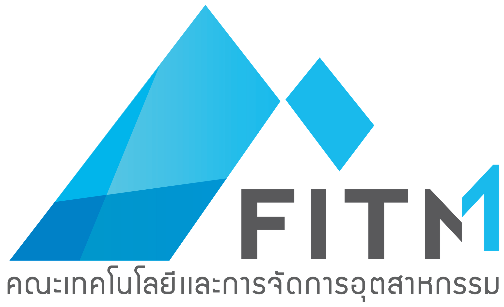

# [FITM Elite](https://elite.fitm.kmutnb.ac.th)

## Who are we?
We are a group of students at King Mongkut's University of Technology North Bangkok. Prachinburi Campus who come together to create creative things and are interested in technology skills

We like to do projects that involve hands-on work on software or other things. related to technology We focus on knowledge and research. Our goal is that we work together to develop technology skills to meet the living needs of the future.

We invite all students to see our group. and interested in technology Come join in something creative.

## Working at
Our group was under Faculty of Industrial and Technology Management, KMUTNB and based on [CreativeLab](https://www.facebook.com/groups/1292355628240051)

  

    

## Links
- Website: [elite.fitm.kmutnb.ac.th](https://elite.fitm.kmutnb.ac.th)
- Facebook: [FITM Elite](https://facebook.com/fitmelite)
- GitHub: [FITM Elite](https://github.com/fitm-elite)
